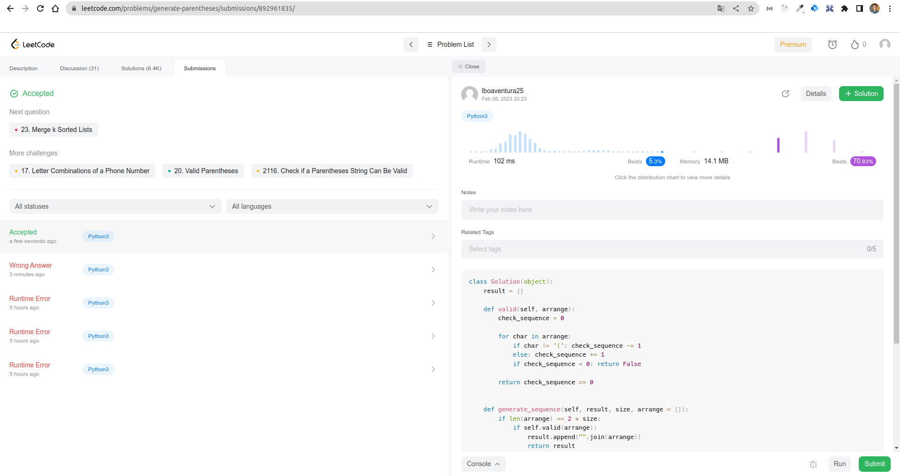
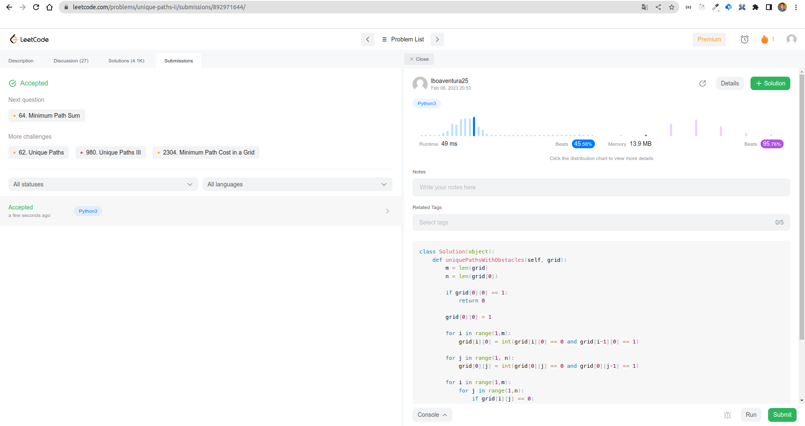

# Leetcode - Programação Dinâmica

**Número da Lista**: 15 
**Conteúdo da Disciplina**: Programação Dinâmica 

## Alunos
|Matrícula | Aluno |
| -- | -- |
| 18/0033034 | Hérick Ferreira de Souza Portugues |
| 18/0114093 | Lucas Ursulino Boaventura          |

## Sobre 
Os objetivos desse projeto, é praticar os conhecimentos adquiridos em sala de aula sobre o assunto **Programação Dinâmica**. Para isso, foram resolvidos alguns exercícios da Plataforma [LeetCode](https://leetcode.com/tag/dynamic-programming/), que já fornece alguns exercícios com a tag *Dynamic Programming*.

Os exercícios resolvidos foram:

- [22 - Generate Parentheses](https://leetcode.com/problems/generate-parentheses/)
- [63 - Unique Paths II](https://leetcode.com/problems/unique-paths-ii/)
- [1463 - Cherry Pickup II](https://leetcode.com/problems/cherry-pickup-ii/)
- [1470 - Shuffle the Array](https://leetcode.com/problems/shuffle-the-array/)

## Link da apresentação

[Apresentação](./assets/apresentacao-LucasHerick.mp4)

## Screenshots

## Instalação 
**Linguagem**: Python 

Não é necessário instalação.

## Uso 

Para testar, basta acessar a questão pretendida (o link encontra-se no README) e submeter a solução correspondente armazenada na pasta `exercicios` (selecionando a linguagem de programação adequada).

